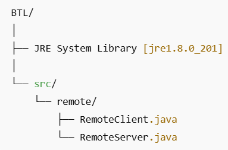
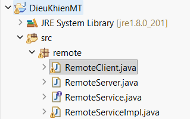
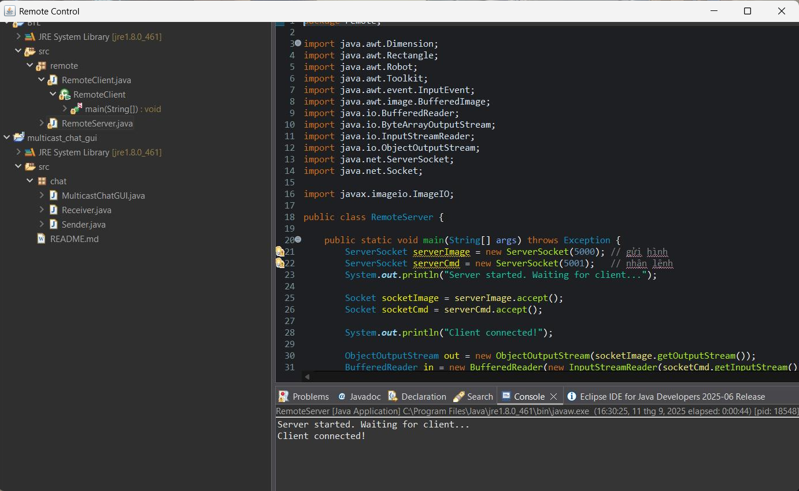

<h2 align="center">
    <a href="https://dainam.edu.vn/vi/khoa-cong-nghe-thong-tin">
    🎓 Faculty of Information Technology (DaiNam University)
    </a>
</h2>
<h2 align="center">
   ỨNG DỤNG ĐIỀU KHIỂN MÁY TÍNH TỪ XA (REMOTE CONTROL)
</h2>

    

        
        
        
    

## 📖 1. Giới thiệu
    Ứng dụng điều khiển máy tính từ xa (Remote Control) 
- Cho phép người dùng truy cập, theo dõi và điều khiển máy tính ở xa thông qua mạng Internet hoặc mạng LAN.
- Hệ thống cho phép một máy tính (Client) có thể kết nối và điều khiển một máy tính khác (Server/Host) theo thời gian thực.
- Máy chủ (Remote Server): là máy tính bị điều khiển, có nhiệm vụ chia sẻ màn hình và tiếp nhận các lệnh điều khiển từ xa.
- Máy khách (Remote Client): là máy tính điều khiển, có nhiệm vụ hiển thị màn hình từ xa và gửi các thao tác chuột, bàn phím đến máy chủ.
- Người dùng có thể xem toàn bộ màn hình của máy từ xa.
- Thao tác chuột, bàn phím như ngồi trực tiếp trước máy.
- Giao diện đơn giản, dễ sử dụng, có thể mở rộng thêm tính năng bảo mật và xác thực.
- Làm việc từ xa (Remote Work).
- Quản trị hệ thống & server.

## 🔧 2. Ngôn ngữ lập trình sử dụng: 
    Thư viện sử dụng trong Java:

- java.net → Socket, ServerSocket (gửi/nhận dữ liệu).

- java.awt.Robot → điều khiển chuột, bàn phím.

- javax.imageio.ImageIO → đọc/ghi ảnh (truyền màn hình).

- javax.swing → hiển thị giao diện Client.

## 🚀 3. Các project đã thực hiện
Cấu trúc:

1. Chuẩn bị

- Cài Java JDK 8+ (bạn đang dùng jre1.8.0_201 là ok).

- Máy A: chạy RemoteServer.java (máy bị điều khiển – bạn bè).

- Máy B: chạy RemoteClient.java (máy điều khiển – bạn).

- Hai máy phải nằm cùng mạng LAN/WiFi hoặc có thể kết nối qua Internet (cần mở port).

2. Lấy địa chỉ IP của Server

- Trên máy bị điều khiển (máy chạy RemoteServer.java):

- Windows: mở CMD → gõ ipconfig → lấy IPv4, ví dụ 192.168.1.10.

- Linux/Mac: mở Terminal → gõ ifconfig

- Sau đó lấy địa chỉ IP Wifi của máy bị điều khiển thay vào host trong RemoteClient.

3. Chạy chương trình

- Trên máy bị điều khiển (Server):

- Mở Eclipse → chuột phải RemoteServer.java → Run As → Java Application.

- Console sẽ in:

    Server is running on port 5000...,
    Waiting for client connection...

- Trên máy điều khiển (Client):

- Mở Eclipse → sửa IP trong RemoteClient.java như trên.

- Chuột phải RemoteClient.java → Run As → Java Application.

5. Kết quả

## 📝 4. License

Họ tên: Nguyễn Chí Nhật

MSV: 1671020231

Lớp: CNTT 16-03

© 2025 AIoTLab, Faculty of Information Technology, DaiNam University. All rights reserved.

---