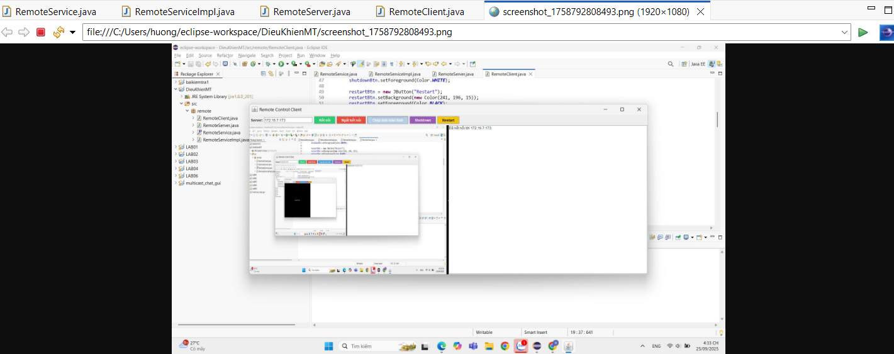
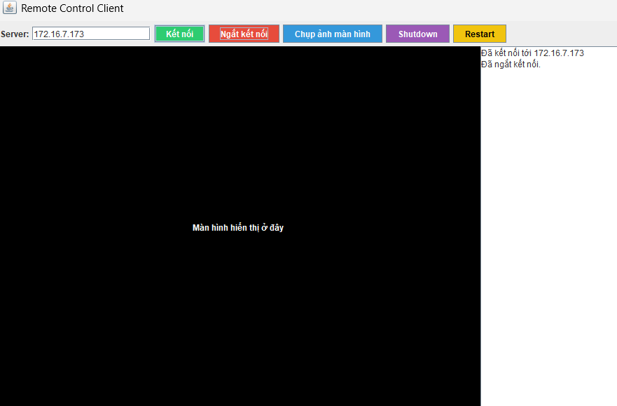
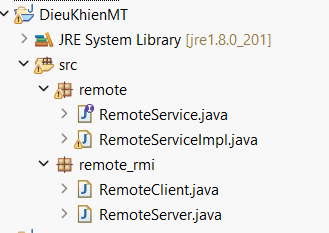
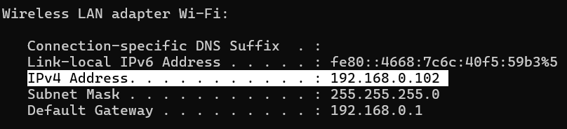

<h2 align="center">
    <a href="https://dainam.edu.vn/vi/khoa-cong-nghe-thong-tin">
    🎓 Faculty of Information Technology (DaiNam University)
    </a>
</h2>
<h2 align="center">
   ỨNG DỤNG ĐIỀU KHIỂN MÁY TÍNH TỪ XA (REMOTE CONTROL)
</h2>

    

        
        
        
    

## 📖 1. Giới thiệu
    Ứng dụng điều khiển máy tính từ xa (Remote Control) 
- Ứng dụng điều khiển máy tính từ xa (Remote Control) là một hệ thống cho phép người dùng có thể thao tác và quản lý một máy tính khác thông qua kết nối mạng. Nhờ đó, bạn có thể sử dụng bàn phím, chuột, và theo dõi màn hình của máy tính bị điều khiển ngay trên máy tính của mình, giống như đang ngồi trực tiếp tại đó.

- Hỗ trợ kỹ thuật từ xa (IT Helpdesk).

- Quản trị hệ thống và máy chủ.

- Làm việc từ xa và truy cập tài nguyên tại văn phòng.

- Học tập, trình bày hoặc hướng dẫn trực tuyến.

## 🔧 2. Ngôn ngữ lập trình sử dụng: 

- Java hỗ trợ lập trình mạng mạnh mẽ với thư viện sẵn có (Socket, RMI).

- RMI (Remote Method Invocation) của Java cho phép gọi phương thức từ xa dễ dàng, phù hợp để xây dựng mô hình Client – Server trong đề tài.

- Có thể chạy đa nền tảng (Windows, Linux, macOS) mà không cần chỉnh sửa nhiều mã nguồn.

## 🚀 3. Các chức năng, hình ảnh

- Sau khi chạy RemoteServer.java:

- Sau khi chạy RemoteClient.java:

## 🚀 4. Các bước cài đặt

Bước 1. Chuẩn bị môi trường

- Cài đặt Java JDK 8 trở lên.

- Thiết lập biến môi trường JAVA_HOME và PATH để có thể dùng lệnh javac và java trong terminal/cmd.

- Kiểm tra bằng lệnh:

java -version
javac -version

Bước 2. Tạo project

- Tạo một thư mục chứa source code

- Bên trong có cấu trúc:

Bước 3. Khởi động server

- Trên máy bị điều khiển (Server):

java RemoteServer

- Kết quả:

RemoteServer đã sẵn sàng...

Bước 4. Kết nối từ Client

- Trên máy điều khiển (Client):

java RemoteClient

- Trong code, nhớ đổi địa chỉ IP (Nếu muốn điều khiển máy tính của người khác):

Registry registry = LocateRegistry.getRegistry("172.16.xx.xx", 1099);

👉 172.16.xx.xx chính là IP của máy bị điều khiển.

- Cách lấy IP của máy bị điều khiển

Win + R -> gõ "cmd" -> gõ "ipconfig" -> lấy IP như hình bên dưới

Bước 5. Kiểm thử

Sau khi kết nối thành công:

- Client sẽ thấy màn hình của Server.

- Di chuyển chuột trên Client → chuột di chuyển trên Server.

- Gõ bàn phím trên Client → chữ hiển thị trên Server.

- Có thể mở Notepad (trên Server) rồi gõ thử từ Client để kiểm chứng.

Bước 6. Mở rộng (tùy chọn)

- Thêm mật khẩu khi client kết nối.

- Thêm chức năng gửi file, chat.

- Chạy nhiều client cùng kết nối server.

## 📝 License

Họ tên: Nguyễn Chí Nhật

MSV: 1671020231

Lớp: CNTT 16-03

© 2025 AIoTLab, Faculty of Information Technology, DaiNam University. All rights reserved.

---