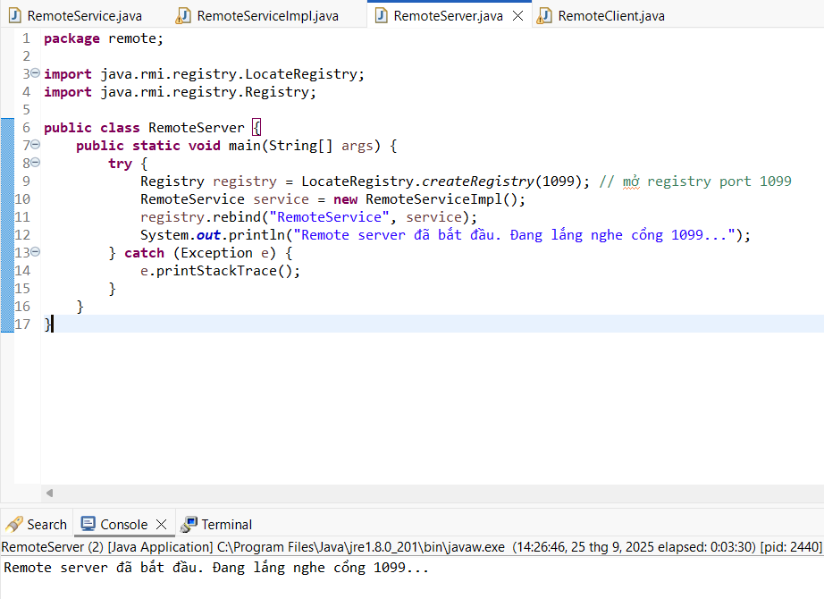

<h2 align="center">
    <a href="https://dainam.edu.vn/vi/khoa-cong-nghe-thong-tin">
    🎓 Faculty of Information Technology (DaiNam University)
    </a>
</h2>
<h2 align="center">
   ỨNG DỤNG ĐIỀU KHIỂN MÁY TÍNH TỪ XA (REMOTE CONTROL)
</h2>
<div align="center">
    <p align="center">
        
        
        
    </p>

[](https://www.facebook.com/DNUAIoTLab)
[](https://dainam.edu.vn/vi/khoa-cong-nghe-thong-tin)
[](https://dainam.edu.vn)

</div>

## 📖 1. Giới thiệu
    Ứng dụng điều khiển máy tính từ xa (Remote Control) 
- Ứng dụng điều khiển máy tính từ xa (Remote Control) là một hệ thống cho phép người dùng có thể thao tác và quản lý một máy tính khác thông qua kết nối mạng. Nhờ đó, bạn có thể sử dụng bàn phím, chuột, và theo dõi màn hình của máy tính bị điều khiển ngay trên máy tính của mình, giống như đang ngồi trực tiếp tại đó.

- Hỗ trợ kỹ thuật từ xa (IT Helpdesk).

- Quản trị hệ thống và máy chủ.

- Làm việc từ xa và truy cập tài nguyên tại văn phòng.

- Học tập, trình bày hoặc hướng dẫn trực tuyến.

## 🔧 2. Ngôn ngữ lập trình sử dụng: [](https://www.java.com/)

Java được lựa chọn vì:  
- Hỗ trợ sẵn RMI (Remote Method Invocation) để giao tiếp từ xa.  
- Có thư viện chuẩn cho xử lý mạng, giao diện đồ họa, và Robot API để điều khiển chuột, bàn phím.  
- Tính đa nền tảng, dễ triển khai trên nhiều hệ điều hành.  
## 🚀 3. Các chức năng, hình ảnh

- Sau khi chạy RemoteServer.java:



- Sau khi chạy RemoteClient.java:


## 🚀 4. Các bước cài đặt

### 1. Yêu cầu
- Cài đặt **Java Development Kit (JDK 8+)**
  - Kiểm tra bằng lệnh:
    ```bash
    java -version
    javac -version
    ```
- Cài đặt **Git** (để clone source code).
- Máy chủ (server) và máy khách (client) phải kết nối chung mạng LAN hoặc có cấu hình port forwarding nếu qua Internet.

---

### 2. Cấu trúc dự án
- Cấu trúc dự án như hình bên dưới:


---

### 3. Biên dịch source code
```bash
javac remote/*.java
```

---

### 4. Chạy chương trình
🖥️ Trên Windows
Mở 2 cửa sổ Command Prompt:

- Cửa sổ 1 (Server – máy bị điều khiển):
```bash
Mở cmd

cd path\to\project

java remote.RemoteServer
```
- Cửa sổ 2 (Client – máy điều khiển):
```bash
Mở cmd

cd path\to\project

java remote.RemoteClient

➝ Khi được hỏi, nhập IP của Server.
```
- Cách lấy địa chỉ IP của Server:
```bash
Mở cmd

Nhập "ipconfig"

Tìm địa chỉ IP LAN như hình dưới:
```


---

### 5. Bắt đầu điều khiển
```bash
Client sẽ hiện cửa sổ màn hình của Server.

Các chức năng:

Click chuột trên máy Server.

Di chuyển chuột trên màn hình Server.

```

## 📝 License

Họ tên: Nguyễn Chí Nhật

MSV: 1671020231

Lớp: CNTT 16-03

© 2025 AIoTLab, Faculty of Information Technology, DaiNam University. All rights reserved.

---